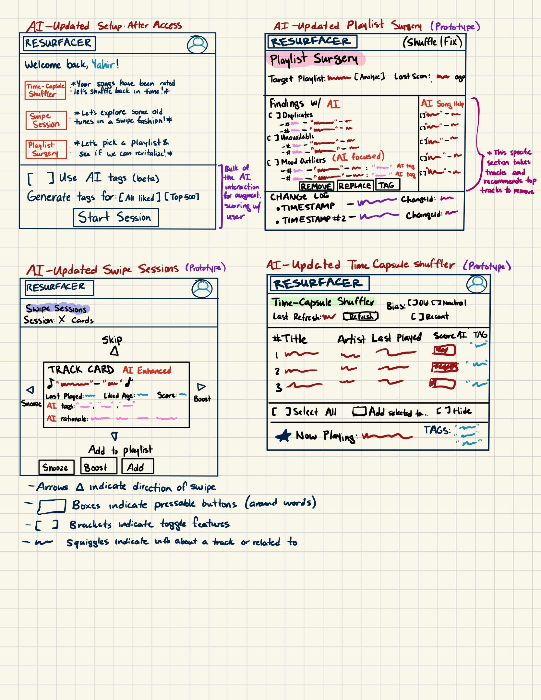

**Link to main repo:** [HERE](https://github.com/notyahir/61040-portfolio)

# Resurfacer (Assignment 3) 

##  Augmented Design
### NON-AUGMENTED AI CONCEPT
    concept: TrackScoring

    purpose: Compute a score for each track in a user's liked song catalog and get top candidates

    principle: After fetching a user's liked song catalog, we score tracks in the catalog in terms of "staleness" based off the track meta that will aid in resurfacing

    state:
        - a set of Weights with
            a user              User
            a last_playedW      Float
            a liked_whenW       Float
            a times_skippedW    Float
        - a set of Boosts with
            a user              User
            a track             Track
            an amount           Float
            an update_time      Float
        - a set of Snoozes with
            a user              User
            a track             Track
            a snoozed_timestamp Float
        
    actions:  
        - score(user: User, track: Track): (s: Float)
            effects: computes a "staleness" score from a user's statistics and adds it to the weights, returns the score

        - preview(user: User, size: Integer [Optioal]): (previewTracks: List<Track>)
            requires: weight of scores exist, number of weights must be greater than or equal to size variable if specified
            effects: previews the tracks specified, amount equal to size if specified
        - keep(user: User, track: Track)
            effects: Adds a track to the set of boosts or boosts the float amount that decays over time

        - snooze(user: User, track: Track, until: Float [Optional])
            effects: adds a track to the snooze set and keeps it snoozed for 2 weeks unless specified otherwise

### AUGMENTED AI CONCEPT
    +: Indicates AI augmentation

    concept: TrackScoring+

    purpose: Compute a resurfacing score that blends staleness with semantic vibe and personal Keep/Snooze signals.

    principle:
    After fetching a user's liked catalog, the concept can operate manually or with an AI augmentation. 

    When augmented, the concept may call an LLM once per track to create a small set of "vibe" tags and a short rationale. These tags are cached (added to state), and if available, will be combined with the manual stateless score to produce an retuned score. If AI tags aren't present, it acts as standard without AI.

    state:
        - a set of Weights with
            a user          User
            a last_playedW  Float
            a liked_whenW   Float
            a num_skippedW  Float 
        - a set of Boosts with
            a user          User
            a track         Track
            a amount        Float
            a update_time   Float
        - a set of Snoozes with
            a user          User
            a track         Track
            a snooze_time   Float
        NEW:
        - a set of Tags with
            a track         Track
            a tags          Set<VIBE>, Enum -> VIBE
            a rationale     String
            a updated_at    Float

          
    actions:
        - score(user: User, track: Track): (s: Float)
            effects: computes a "staleness" score from a user's statistics and adds it to the weights, returns the score
        - preview(user: User, size: Integer [Optional]): (previewTracks: List<Track>)            
            requires: weight of scores exist, number of weights must be greater than or equal to size variable if specified
            effects: previews the tracks specified, amount equal to size if specified
        - keep(user: User, track: Track)
            effects: adds a track to the set of boosts or boosts the float amount that decays over time
        - snooze(user: User, track: Track, until: Float [Optional])
            effects: adds a track to the snooze set and keep its snoozed for 2 weeks unless otherwise specified
        NEW:
        - tag(user: User, track: Track): (tags: Set<VIBE>, rationale: String)
            requires: track is valid
            effects:
                - calls an LLM to infer a set of tags from the VIBE enum and a rationale
                - checks and rejects any unknown tags
                - writes updates to the set of Tags for a track that is tagged
                - returns the tags as a Set<VIBE> and a rationale as a string

        - scoreAI(user: User, track: Track): (s: Float)
            effects: gets the manual staleness score via score() and gets the tags from Tags, returns an adjusted score based off the tags (AI) and the staleness score (manual)

        - previewAI(user: User, size: Integer [Optional]): (previewTracks: List<Track>)
            effects: returns the top scores ranked by scoreAI
    note: 
        - we define a VIBE enum as: {upbeat, energetic, mellow, chill, melancholic, dark, bright} with these labels to categorize a song. 
        - the labels for the VIBE enum are not set in stone. can clearly be reworked. However, when deployed, if an LLM suggets a label (hallucinates) outside of the set, it will be rejected 

        - tag is an optional action, concept is usable without calling it
        - scoreAI doesn't decrease functionality, if tags are missing or invalid, behaves like score

        - scores are computed on the fly, might be useful to have a small cache but a function can recompute scores when needed

## User Interaction Designed
Same notes as last time but to reiterate:
- In all the pages, "Resurfacer" is in the top-left which redirects all users to the home page (setup page). 
- There is a profile icon in the top right for users to login or with the connect button on the setup page.

### A Brief Journey: Yahir

Yahir is upset that Resurfacer 1.0 went down, however, Resurfacer 2.0 has come back and with a new AI augmented feature! You now have the ability to tag your tracks. Hearing the news,
Yahir was ecstatic, rushed to his computer, and opened the Resurfacer page. He remembers his issues: his liked songs are in the thousands since the last time he made his playlist,  scrolling won't surface the bangers fast enough and is boring, and thus his playlists are off! 

He clicks on the new app and is brought to the set up screen. He is in awe of the new Resurfacer 2.0. "Wow, the developers are really awesome", he thinks. He quickly sets up and he sees a completely new section on the setup page has never seen before. There is now a BETA feature that allows users to tag their songs with AI which will help score their tracks much more efficiently and easily. So, after connecting his Spotify account to Resurfacer 2.0, he clicks on the AI beta tag toggles and then proceeds with the Swipe Sessions.

Immediatley, Yahir notices a big difference. The tracks are much more detailed with information and even provide a rationale for the tag decision. He thinks it's a pretty cool summary of the track and he appreciates the tag as he truly believes it'll help him to pick out songs more efficiently especially based on the vibe he is feeling that day.

The outcome? Yahir now has found an entertaining way to revisit his old songs but also revive his old playlists with broken songs fixed, duplicates cleaned, and a handful of resurfaced classics added in! Beyond this, there is now an incredibly useful AI feature that is helping him sort his songs in a more efficient and fine manner!

## Concept Implemented
- [trackscoring implementation](trackscoring.ts)
- [trackscoring types](trackscoring-types.ts)
- [trackscoring tests](trackscoring-tests.ts)
- [trackscoring spec](trackscoring.spec)

## Richer Test Cases

Please see [trackscoring implementation](trackscoring.ts) lines 168-344 for the prompt explanations and prompt variants.

Please see [trackscoring tests](trackscoring-tests.ts) to see the tests and how the refined tag prompt handles these issues by giving good outputs

## Validators

1. For our output from the LLM, we are expecting a parsable JSON file. This means that our code specifically handles a JSON file, and thus we rely on the LLM to give a correct output. However, of course it is possible that the LLM will forget the series of steps and could even give the output as a different format randomly. We tried to prompt engineer a good response but it's possible it can still fail and give faulty outputs. Our way of handlng this is by try and catch if the parse function fails. 

However, even so, we assert that the tags are an array and that rationale is a string. If this fails, then we throw an error. It's sort of two validators for one issue

2. There are many words in the dictionary to describe a song, so it is possible, that even though we have a limited number of vibe identifiers for a song, the LLM can hallucinate and think of a different word for a song, especially if it think it fits. While we try to prompt engineer this and fix this, we still filter any vibe tag to the VIBE enum, remove duplicates, and ensure we have 1-3 tags

3. It is possible for the LLM to mislabel a song as another based on the title even if the energy is off. To overcome this, we prompt engineer the model to look at the song values, however, we can also add these safeguards into our code to ensure that our model still doesn't hallucinate even after this change

# Resources

- [Google Generative AI Documentation](https://ai.google.dev/docs)
- [TypeScript Documentation](https://www.typescriptlang.org/docs/)
